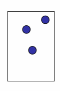
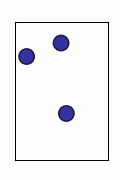
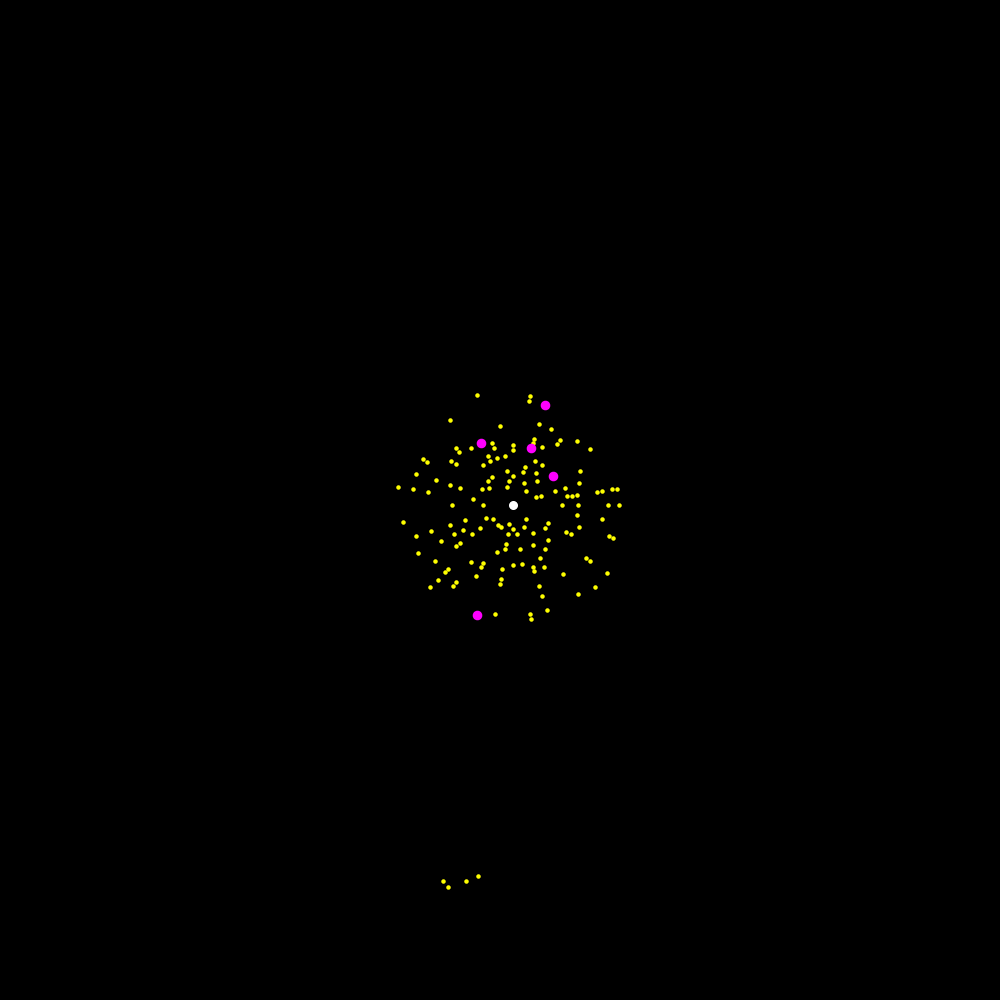

## Particle Collision

One example per row.

First column: simulation (overservational). Second column: simulation (counterfactual). Third column: cf-SPN prediction (counterfactual)

## Galaxy Collision

Simulation (overservational)

Simulation (counterfactual)

cf-SPN Prediction (counterfactual)
